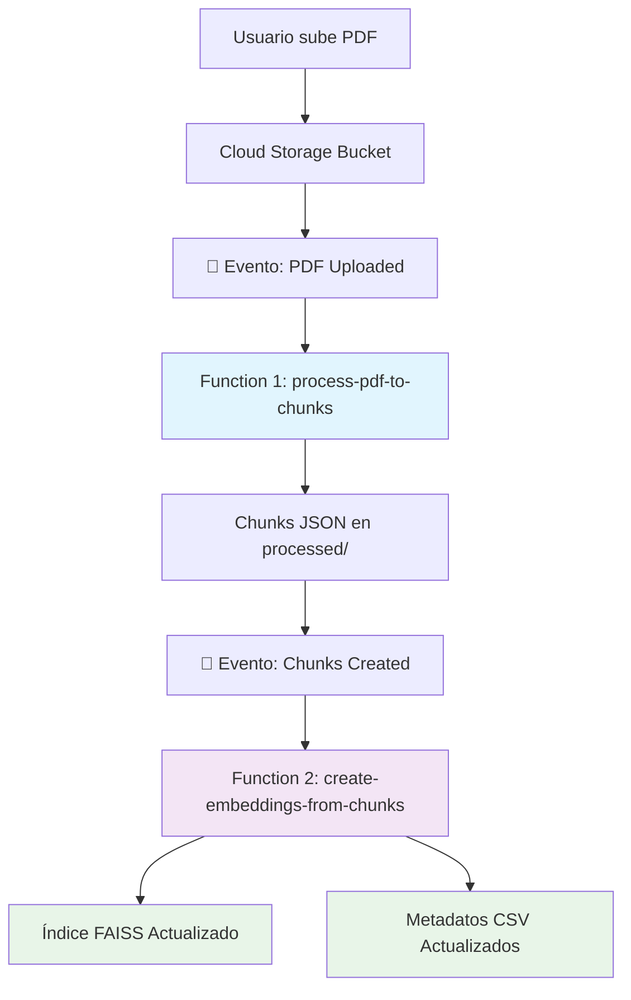

# Nueva Arquitectura Orientada a Eventos - DrCecim Upload

## Resumen

Este documento describe la nueva arquitectura orientada a eventos implementada para mejorar la robustez, escalabilidad y mantenibilidad del sistema de procesamiento de documentos DrCecim.

## Problemas Resueltos

### 🔴 Problemas de la Arquitectura Anterior
- **Función Monolítica**: Una sola función manejaba todo el pipeline (PDF → Chunks → Embeddings → GCS)
- **Timeouts**: Documentos grandes podían exceder los límites de tiempo de Cloud Functions
- **Falta de Robustez**: Si fallaba cualquier paso, todo el proceso fallaba
- **Escalabilidad Limitada**: No se podía escalar independientemente cada etapa

### ✅ Ventajas de la Nueva Arquitectura
- **Desacoplamiento**: Cada función tiene una responsabilidad específica
- **Tolerancia a Fallos**: Si falla una etapa, las otras pueden continuar
- **Escalabilidad Independiente**: Cada función puede escalar según sus necesidades
- **Procesamiento Asíncrono**: No hay esperas bloqueantes para el usuario
- **Mejor Monitoreo**: Cada etapa se puede monitorear independientemente

## Arquitectura



## Componentes

### 1. Function 1: `process-pdf-to-chunks`

**Responsabilidad**: Convertir PDFs a chunks de texto estructurados.

**Trigger**: Se activa automáticamente cuando se sube un archivo `.pdf` al bucket de Cloud Storage.

**Proceso**:
1. Descarga el PDF desde GCS
2. Usa Marker PDF para extraer y procesar el texto
3. Genera chunks con metadata
4. Sube el archivo `{nombre}_chunks.json` al prefijo `processed/`

**Configuración**:
- Memoria: 1024MB
- Timeout: 9 minutos (540s)
- Instancias máximas: 10

### 2. Function 2: `create-embeddings-from-chunks`

**Responsabilidad**: Generar embeddings y actualizar el índice FAISS global.

**Trigger**: Se activa cuando aparece un archivo `*_chunks.json` en el prefijo `processed/`.

**Proceso**:
1. Descarga el archivo de chunks
2. Genera embeddings usando OpenAI API
3. Descarga el índice FAISS existente (si existe)
4. Actualiza el índice de manera incremental
5. Sube el índice actualizado y metadatos a GCS

**Configuración**:
- Memoria: 2048MB
- Timeout: 15 minutos (900s)
- Instancias máximas: 5

## Estructura de Datos

### Bucket Layout
```
gs://tu-bucket/
├── documento1.pdf                    # ← PDFs subidos aquí
├── documento2.pdf
├── processed/
│   ├── documento1_chunks.json        # ← Chunks procesados
│   └── documento2_chunks.json
├── embeddings/
│   └── faiss_index.bin              # ← Índice FAISS global
└── metadata/
    └── metadata.csv                 # ← Metadatos globales
```

### Formato de Chunks JSON
```json
{
  "filename": "documento1.pdf",
  "source_file": "documento1.pdf",
  "num_chunks": 45,
  "total_words": 1250,
  "processing_timestamp": "2024-01-15T10:30:00Z",
  "chunks": [
    {
      "chunk_id": 0,
      "text": "Contenido del chunk...",
      "word_count": 28,
      "page_numbers": [1, 2]
    }
  ],
  "metadata": {
    "document_type": "academic",
    "language": "es",
    "extraction_method": "marker_pdf"
  }
}
```

## Despliegue

### Prerrequisitos
1. **Variables de entorno** configuradas en `.env`:
   ```bash
   GCF_PROJECT_ID=tu-proyecto-id
   GCS_BUCKET_NAME=tu-bucket
   GCF_REGION=us-central1
   OPENAI_API_KEY=tu-api-key
   ```

2. **Cuenta de servicio** con permisos:
   - Cloud Functions Developer
   - Storage Admin
   - Service Account User

### Comandos de Despliegue

#### Opción 1: Script Automático (Recomendado)
```bash
cd cloud_functions
./deploy_event_driven.sh
```

#### Opción 2: Despliegue Manual
```bash
# Función 1
gcloud functions deploy process-pdf-to-chunks \
  --gen2 \
  --runtime=python311 \
  --region=us-central1 \
  --source=. \
  --entry-point=process_pdf_to_chunks \
  --trigger-event-filters="type=google.cloud.storage.object.v1.finalized" \
  --trigger-event-filters="bucket=tu-bucket" \
  --trigger-event-filters-path-pattern="*.pdf" \
  --service-account=chatbot-pipeline-sa@tu-proyecto.iam.gserviceaccount.com

# Función 2  
gcloud functions deploy create-embeddings-from-chunks \
  --gen2 \
  --runtime=python311 \
  --region=us-central1 \
  --source=. \
  --entry-point=create_embeddings_from_chunks \
  --trigger-event-filters="type=google.cloud.storage.object.v1.finalized" \
  --trigger-event-filters="bucket=tu-bucket" \
  --trigger-event-filters-path-pattern="processed/*_chunks.json" \
  --service-account=chatbot-pipeline-sa@tu-proyecto.iam.gserviceaccount.com
```

## Uso

### Para Procesar un Documento

1. **Sube el PDF directamente al bucket**:
   ```bash
   gsutil cp mi_documento.pdf gs://tu-bucket/
   ```

2. **El sistema procesará automáticamente**:
   - ✅ Function 1 detectará el PDF y lo procesará
   - ✅ Function 2 detectará los chunks y generará embeddings
   - ✅ El índice FAISS se actualizará incrementalmente

3. **No hay esperas**: El proceso es completamente asíncrono

### Para la App Streamlit

La app Streamlit ahora puede:
- Subir archivos directamente al bucket usando `GCSService`
- Mostrar un mensaje de "procesamiento iniciado"
- Opcionalmente implementar verificación de estado

## Monitoreo

### Logs de Cloud Functions
```bash
# Ver logs de la función 1
gcloud functions logs read process-pdf-to-chunks --region=us-central1

# Ver logs de la función 2  
gcloud functions logs read create-embeddings-from-chunks --region=us-central1
```

### Métricas Importantes
- **Latencia**: Tiempo de procesamiento por documento
- **Errores**: Fallos en cualquiera de las etapas
- **Throughput**: Documentos procesados por hora
- **Costos**: Llamadas a OpenAI API y recursos de GCP

### Health Checks
Ambas funciones exponen endpoints de health check:
```bash
curl https://us-central1-tu-proyecto.cloudfunctions.net/process-pdf-to-chunks/health
curl https://us-central1-tu-proyecto.cloudfunctions.net/create-embeddings-from-chunks/health
```

## Actualización Incremental de FAISS

La nueva arquitectura implementa actualización incremental del índice FAISS:

1. **Descarga** el índice existente desde GCS
2. **Combina** los nuevos vectores con los existentes
3. **Actualiza** metadatos concatenando DataFrames
4. **Sube** el índice actualizado de vuelta a GCS

Esto permite:
- ✅ Mantener un único índice global
- ✅ Agregar documentos sin reconstruir todo
- ✅ Preservar la eficiencia de búsqueda
- ✅ Reducir costos de procesamiento

## Migración desde Arquitectura Anterior

### Función Legacy
La función original `process_document` en `main.py` sigue disponible pero se considera **legacy**. 

### Coexistencia
- ✅ Ambas arquitecturas pueden coexistir
- ✅ La función legacy funciona independientemente  
- ✅ Gradualmente migrar hacia la nueva arquitectura

### Ventajas de Migrar
- 📈 **Mayor robustez** ante fallos
- ⚡ **Mejor escalabilidad** 
- 🔧 **Más fácil mantenimiento**
- 💰 **Potencialmente más económico**

## Troubleshooting

### Problemas Comunes

#### 1. PDF no se procesa
- ✅ Verificar que el archivo tenga extensión `.pdf`
- ✅ Revisar logs de `process-pdf-to-chunks`
- ✅ Verificar permisos del bucket

#### 2. Embeddings no se generan
- ✅ Verificar que aparezca el archivo `*_chunks.json` en `processed/`
- ✅ Revisar API key de OpenAI
- ✅ Verificar logs de `create-embeddings-from-chunks`

#### 3. Índice FAISS no se actualiza
- ✅ Verificar permisos de escritura en el bucket
- ✅ Revisar espacio disponible
- ✅ Verificar logs para errores de memoria

### Comandos Útiles

```bash
# Listar archivos en el bucket
gsutil ls -r gs://tu-bucket/

# Ver estado de las funciones
gcloud functions describe process-pdf-to-chunks --region=us-central1
gcloud functions describe create-embeddings-from-chunks --region=us-central1

# Ver métricas de uso
gcloud logging read "resource.type=cloud_function" --limit=50
```

## Próximos Pasos

1. **Notificaciones**: Implementar notificaciones cuando el procesamiento complete
2. **Dashboard**: Crear panel de monitoreo en tiempo real  
3. **Retry Logic**: Agregar lógica de reintentos para fallos transitorios
4. **Batching**: Procesar múltiples documentos en lotes
5. **Optimización**: Ajustar configuraciones basándose en métricas de uso 